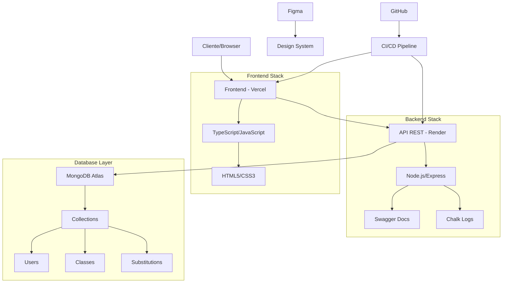

# Sub_Aulas - Sistema de Gestão de Substituição de Aulas

<div align="center">


**Plataforma web para otimização do processo de substituição de aulas no ambiente educacional do Senac**

[🌐 Visualizar Aplicação](https://sub-aulas.vercel.app/) • [📋 Documentação da API](https://github.com/Masterbarreto/ApiSubAulas) • [🎨 Design System](https://www.figma.com/design/IUSOYtXSlyyjXeI9szk8z7/Projeto-de-Subtição-de-Aulas?node-id=82-2&p=f&t=IHAJcfgFbdfpIGJ8-0)

</div>

---

## 📋 Índice

- [Sobre o Projeto](#-sobre-o-projeto)
- [Funcionalidades](#-funcionalidades)
- [Tecnologias](#-tecnologias)
- [Arquitetura](#-arquitetura)
- [Instalação](#-instalação)
- [Docker & Containerização](#-docker--containerização)
- [CI/CD](#-ci/cd)
- [Uso](#-uso)
- [Roadmap](#-roadmap)
- [Equipe](#-equipe)
- [Contribuição](#-contribuição)
- [Licença](#-licença)

---

## 🎯 Sobre o Projeto

O **Sub_Aulas** é uma solução tecnológica desenvolvida para modernizar e otimizar o processo de substituição de aulas no ambiente educacional do Senac. O sistema oferece uma interface intuitiva e segura que permite aos professores cadastrar, visualizar e gerenciar aulas disponíveis para substituição de forma eficiente.

### 🔍 Problema Identificado
- Processo manual e demorado para substituição de aulas
- Falta de transparência na disponibilidade de substituições
- Dificuldade no controle administrativo e fiscal
- Comunicação ineficiente entre professores e coordenação

### 💡 Solução Proposta
Uma plataforma web centralizada que garante:
- **Transparência** no processo de substituição
- **Agilidade** na busca e cadastro de aulas
- **Controle** administrativo e pedagógico aprimorado
- **Segurança** através de autenticação robusta

---

## ⚡ Funcionalidades

### 🔐 Autenticação e Segurança
- Sistema de login seguro para professores
- Criptografia de senhas com Bcrypt
- Controle de sessões e permissões

### 📚 Gestão de Aulas
- **Cadastro** de aulas disponíveis para substituição
- **Consulta** em tempo real de oportunidades
- **Filtros avançados** por curso, série e professor
- **Edição e exclusão** de registros próprios

### 📊 Monitoramento e Controle
- **Sistema de logs** detalhado com Chalk
- **Documentação automática** da API com Swagger
- **Rastreabilidade** completa das operações

### 🛠 Novidades na Versão 1.1.0
- **Integração com Segment Analytics**:
  - Rastreio de rotas e atividades do usuário.
  - Inicialização do Segment Analytics no componente `App`.
  - Registro de visualizações de página em mudanças de rota.
- **Registro de Atividades do Usuário**:
  - Implementado em `AulaScreens` e `EditarAula` para ações como concluir ou editar aulas.
- **Relatórios e Visualização de Dados**:
  - Adicionado um dashboard no componente `RelatorioEdit` com gráficos interativos.
  - Criados os componentes `Grafico1`, `Grafico2` e `Grafico3` para visualização de dados.
- **Melhorias na Interface**:
  - Estilos atualizados para gráficos e seções de relatórios.
- **Refatoração**:
  - Simplificação do arquivo `main.jsx` para uso do `BrowserRouter`.

---

## 🛠 Tecnologias

### Frontend
```
TypeScript    - Tipagem estática e desenvolvimento robusto
JavaScript    - Lógica de negócio do cliente
HTML5         - Estruturação semântica
CSS3          - Estilização e responsividade
```

### Backend
```
Node.js       - Runtime JavaScript server-side
Express.js    - Framework web minimalista e flexível
MongoDB       - Banco de dados NoSQL escalável
Yup           - Validação de esquemas de dados
Bcrypt        - Hashing seguro de senhas
Swagger       - Documentação automática de APIs
Chalk         - Sistema de logs colorido
```

### Infraestrutura e DevOps
```
Vercel        - Hospedagem e deploy do frontend
Render        - Hospedagem do backend e APIs
MongoDB Atlas - Banco de dados em nuvem
Git/GitHub    - Controle de versão e colaboração
```

### Design e Prototipagem
```
Figma         - Design system e prototipagem
Draw.io       - Diagramação da arquitetura
```

---

## 🏗 Arquitetura



---

## 🚀 Instalação

### Pré-requisitos
```bash
Node.js >= 16.0.0
npm >= 8.0.0
MongoDB >= 5.0
Git >= 2.0
```

### Configuração do Ambiente

1. **Clone os repositórios**
```bash
# Backend
git clone https://github.com/Masterbarreto/ApiSubAulas.git
cd ApiSubAulas

# Frontend
git clone https://github.com/Masterbarreto/Front_Aulas.git
cd Front_Aulas
```

2. **Instale as dependências**
```bash
# No diretório do backend
npm install

# No diretório do frontend
npm install
```

3. **Configure as variáveis de ambiente**
```bash
# Crie um arquivo .env no backend
cp .env.example .env

# Configure as variáveis necessárias
DATABASE_URL=mongodb://localhost:27017/sub_aulas
JWT_SECRET=seu_jwt_secret_aqui
PORT=3001
```

4. **Execute o projeto**
```bash
# Backend (em um terminal)
cd ApiSubAulas
npm run dev

# Frontend (em outro terminal)
cd Front_Aulas/Sub_Aulas
npm run dev
```

---

## 🐳 Docker & Containerização

O projeto **Sub_Aulas** está totalmente configurado para execução em containers Docker, proporcionando um ambiente de desenvolvimento consistente e portável.

### 📦 Pré-requisitos para Docker
```bash
Docker >= 20.0.0
Docker Compose >= 2.0.0
```

### 🚀 Execução com Docker

#### **Método 1: Docker Compose (Recomendado)**
```bash
# Clone o repositório
git clone https://github.com/Masterbarreto/Front_Aulas.git
cd Front_Aulas/Sub_Aulas

# Construa e execute o container
docker compose up --build

# Para executar em background
docker compose up -d --build

# Para parar o container
docker compose down
```

#### **Método 2: Docker Build Manual**
```bash
# Construa a imagem
docker build -t sub-aulas .

# Execute o container
docker run -p 5173:5173 \
  -v $(pwd):/app \
  -v /app/node_modules \
  sub-aulas
```

### 🔧 Configuração Docker

O projeto inclui os seguintes arquivos de configuração:

#### **Dockerfile**
```dockerfile
FROM node:18-alpine
WORKDIR /app
COPY package*.json ./
RUN npm install
COPY . .
EXPOSE 5173
CMD ["npm", "run", "dev", "--", "--host", "0.0.0.0"]
```

#### **docker-compose.yml**
```yaml
version: '3.8'
services:
  frontend:
    build: .
    ports:
      - "5173:5173"
    volumes:
      - .:/app
      - /app/node_modules
    environment:
      - NODE_ENV=development
      - CHOKIDAR_USEPOLLING=true
```

#### **.dockerignore**
```
node_modules
.git
.env.local
dist
build
coverage
*.log
```

### 🌐 Acesso ao Container

Após executar o container, a aplicação estará disponível em:
- **URL**: http://localhost:5173
- **Hot Reload**: ✅ Habilitado
- **API**: Conectada automaticamente

### 💡 Vantagens da Containerização

- **🔒 Isolamento**: Ambiente completamente isolado
- **📦 Portabilidade**: Executa em qualquer sistema com Docker
- **🔄 Consistência**: Mesmo ambiente em dev/prod
- **⚡ Performance**: Otimização de cache de dependências
- **🛠️ Desenvolvimento**: Hot reload funcional

### 🐛 Troubleshooting Docker

```bash
# Ver logs do container
docker compose logs -f

# Reconstruir sem cache
docker compose build --no-cache

# Limpar volumes
docker compose down -v

# Verificar containers rodando
docker ps

# Acessar o container
docker compose exec frontend sh
```

---

## 🔄 CI/CD - Integração Contínua

O projeto inclui workflows automatizados de GitHub Actions para build e deploy:

#### **Workflows Disponíveis:**

1. **🏗️ docker-simple.yml** - Build básico para testes
2. **🚀 docker-production.yml** - Build completo com deploy
3. **🔧 docker-ci.yml** - Pipeline completo com testes

#### **Funcionalidades do CI/CD:**

- ✅ **Build automático** em push/PR
- ✅ **Testes e linting** automáticos
- ✅ **Multi-platform build** (AMD64/ARM64)
- ✅ **Push para registries** (GitHub Container Registry)
- ✅ **Security scanning** com Trivy
- ✅ **Cache inteligente** para builds rápidos

#### **Configuração:**

```yaml
# .github/workflows/docker-production.yml
name: Sub_Aulas Docker Build & Deploy
on:
  push:
    branches: [ "main", "develop" ]
jobs:
  build-and-test:
    runs-on: ubuntu-latest
    steps:
      - uses: actions/checkout@v4
      - name: Build Docker image
        run: docker build -t sub-aulas .
```

#### **Registries Suportados:**

- 📦 **GitHub Container Registry**: `ghcr.io/seu-usuario/sub-aulas-frontend`
- 🐳 **Docker Hub**: Configure `DOCKERHUB_USERNAME` e `DOCKERHUB_TOKEN`

#### **Comandos para usar a imagem:**

```bash
# Pull da imagem
docker pull ghcr.io/seu-usuario/sub-aulas-frontend:latest

# Executar container
docker run -p 5173:5173 ghcr.io/seu-usuario/sub-aulas-frontend:latest
```

---

## 📖 Uso

### Acesso ao Sistema
1. Acesse [https://sub-aulas.vercel.app/](https://sub-aulas.vercel.app/)
2. Faça login com suas credenciais de professor
3. Navegue pelas funcionalidades disponíveis

### Cadastro de Aula para Substituição
1. Clique em "Nova Substituição"
2. Preencha os dados da aula (curso, série, data, horário)
3. Confirme o cadastro
4. A aula ficará disponível para outros professores

### Busca de Substituições
1. Use os filtros disponíveis (curso, série, professor)
2. Visualize as oportunidades em tempo real
3. Candidate-se às substituições desejadas

---

## 🗺 Roadmap

### 🎯 Curto Prazo (1-3 meses)
- [ ] **Sistema de Notificações**
  - Alertas por e-mail para novas oportunidades
  - Notificações push no navegador
  - Lembretes de aulas próximas

### 📊 Médio Prazo (3-6 meses)
- [ ] **Dashboard Analytics**
  - Métricas de substituições por professor
  - Relatórios de frequência e performance
  - Gráficos de demanda por curso/série

### 🤖 Longo Prazo (6-12 meses)
- [ ] **Chatbot Inteligente**
  - Assistente virtual para dúvidas
  - Sugestões automáticas de substituições
  - Integração com IA para otimização

### 🔄 Melhorias Contínuas
- [ ] App mobile nativo
- [ ] Integração com sistemas acadêmicos
- [ ] Sistema de avaliação de substituições
- [ ] Módulo financeiro automatizado

---

## 👥 Equipe

### Desenvolvedores
<table>
  <tr>
    <td align="center">
      <strong>Pedro Henrique Vieira Barreto</strong><br>
      <em>Full Stack Developer</em><br>
      📧 Contato disponível no GitHub
    </td>
    <td align="center">
      <strong>Aloisio Terra Nova Neto</strong><br>
      <em>Full Stack Developer</em><br>
      📧 Contato disponível no GitHub
    </td>
  </tr>
</table>

### Orientação Acadêmica
<table>
  <tr>
    <td align="center">
      <strong>Prof. Giuliana de Jesus Salles</strong><br>
      <em>Orientadora</em>
    </td>
    <td align="center">
      <strong>Prof. Victor Moreira Queiroz</strong><br>
      <em>Orientador</em>
    </td>
  </tr>
</table>

---

## 🤝 Contribuição

Contribuições são sempre bem-vindas! Para contribuir:

1. **Fork** o projeto
2. **Crie** uma branch para sua feature (`git checkout -b feature/AmazingFeature`)
3. **Commit** suas mudanças (`git commit -m 'Add some AmazingFeature'`)
4. **Push** para a branch (`git push origin feature/AmazingFeature`)
5. **Abra** um Pull Request

### 📋 Guidelines de Contribuição
- Siga os padrões de código estabelecidos
- Escreva testes para novas funcionalidades
- Documente mudanças significativas
- Mantenha commits claros e concisos

---

## 📄 Licença

Este projeto está sob a licença MIT. Veja o arquivo [LICENSE](LICENSE) para mais detalhes.

---

## 📞 Suporte

- 📧 **Issues:** [GitHub Issues](https://github.com/Masterbarreto/ApiSubAulas/issues)
- 📖 **Documentação:** [API Docs](https://github.com/Masterbarreto/ApiSubAulas)
- 🎨 **Design System:** [Figma](https://www.figma.com/design/IUSOYtXSlyyjXeI9szk8z7/Projeto-de-Subtição-de-Aulas)

---

<div align="center">

**Desenvolvido com ❤️ pela equipe Sub_Aulas**

[⬆️ Voltar ao topo](#sub_aulas---sistema-de-gestão-de-substituição-de-aulas)

</div>