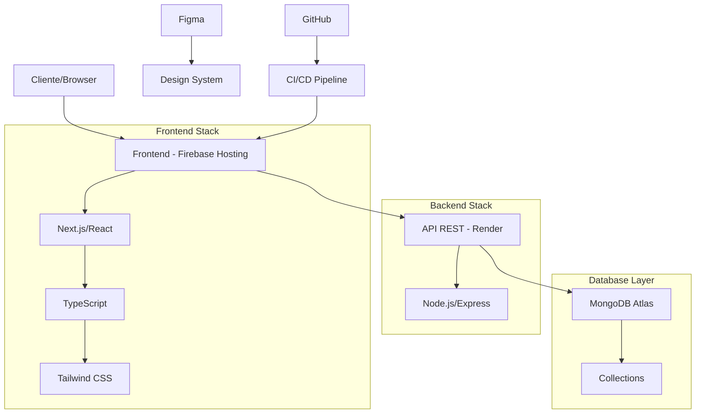

# Sub_Aulas - Sistema de Gestão de Substituição de Aulas

<div align="center">


**Plataforma web para otimização do processo de substituição de aulas no ambiente educacional do Senac**

[🌐 Visualizar Aplicação](https://sub-aulas.vercel.app/) • [📋 Documentação da API](https://github.com/Masterbarreto/ApiSubAulas) • [🎨 Design System](https://www.figma.com/design/IUSOYtXSlyyjXeI9szk8z7/Projeto-de-Subtição-de-Aulas?node-id=82-2&p=f&t=IHAJcfgFbdfpIGJ8-0)

</div>

---

## 📋 Índice

- [Sobre o Projeto](#-sobre-o-projeto)
- [Funcionalidades](#-funcionalidades)
- [Tecnologias](#-tecnologias)
- [Arquitetura](#-arquitetura)
- [Instalação](#-instalação)
- [Uso](#-uso)
- [Roadmap](#-roadmap)
- [Equipe](#-equipe)
- [Contribuição](#-contribuição)
- [Licença](#-licença)

---

## 🎯 Sobre o Projeto

O **Sub_Aulas** é uma solução tecnológica desenvolvida para modernizar e otimizar o processo de substituição de aulas no ambiente educacional do Senac. O sistema oferece uma interface intuitiva e segura que permite aos professores cadastrar, visualizar e gerenciar aulas disponíveis para substituição de forma eficiente.

### 🔍 Problema Identificado
- Processo manual e demorado para substituição de aulas
- Falta de transparência na disponibilidade de substituições
- Dificuldade no controle administrativo e fiscal
- Comunicação ineficiente entre professores e coordenação

### 💡 Solução Proposta
Uma plataforma web centralizada que garante:
- **Transparência** no processo de substituição
- **Agilidade** na busca e cadastro de aulas
- **Controle** administrativo e pedagógico aprimorado
- **Segurança** através de autenticação robusta

---

## ⚡ Funcionalidades

### 🔐 Autenticação e Segurança
- Sistema de login seguro para professores
- Controle de sessões e permissões
- Roteamento protegido para seções administrativas

### 📚 Gestão de Aulas
- **Cadastro** de aulas disponíveis para substituição com upload de arquivos e links.
- **Consulta** em tempo real de oportunidades com filtros por ano, curso e matéria.
- **Edição e exclusão** de aulas.
- **Marcar aulas como concluídas** para rastreamento.

### 📊 Monitoramento e Controle
- **Relatório de Aulas Concluídas**: Uma visão clara das aulas que já foram ministradas.
- **Dashboard de Gerenciamento**: Painel com estatísticas e uma tabela completa para gerenciar todas as aulas.
- **Interface Responsiva**: Design adaptado para desktops, tablets e celulares.

---

## 🛠 Tecnologias

O projeto é construído com tecnologias modernas, focando em performance, escalabilidade e uma ótima experiência de desenvolvimento.

### Frontend
- **Framework**: [Next.js](https://nextjs.org/) (com App Router)
- **Linguagem**: [TypeScript](https://www.typescriptlang.org/)
- **Biblioteca UI**: [React](https://react.dev/)
- **Estilização**: [Tailwind CSS](https://tailwindcss.com/)
- **Componentes UI**: [Shadcn/UI](https://ui.shadcn.com/)
- **Ícones**: [Lucide React](https://lucide.dev/)
- **Formulários**: [React Hook Form](https://react-hook-form.com/) & [Zod](https://zod.dev/)

### Backend
```
Node.js       - Runtime JavaScript server-side
Express.js    - Framework web minimalista e flexível
MongoDB       - Banco de dados NoSQL escalável
```

### Infraestrutura e DevOps
```
Firebase Hosting - Hospedagem e deploy do frontend
Render        - Hospedagem do backend e APIs
MongoDB Atlas - Banco de dados em nuvem
Git/GitHub    - Controle de versão e colaboração
```

### Design e Prototipagem
```
Figma         - Design system e prototipagem
```
---

## 🏗 Arquitetura


```mermaid
graph TB
    A[Cliente/Browser] --> B[Frontend - Firebase Hosting]
    B --> C[API REST - Render]
    C --> D[MongoDB Atlas]
    
    E[Figma] --> F[Design System]
    G[GitHub] --> H[CI/CD Pipeline]
    H --> B
    
    subgraph "Frontend Stack"
        B --> I[Next.js/React]
        I --> J[TypeScript]
        J --> K[Tailwind CSS]
    end
    
    subgraph "Backend Stack"
        C --> L[Node.js/Express]
    end
    
    subgraph "Database Layer"
        D --> M[Collections]
    end
```

---

## 🚀 Instalação

### Pré-requisitos
```bash
Node.js >= 18.0.0
npm >= 9.0.0
Git >= 2.0
```

### Configuração do Ambiente

1. **Clone o repositório do Frontend**
```bash
git clone https://github.com/Masterbarreto/Front_Aulas.git
cd Front_Aulas
```

2. **Instale as dependências**
```bash
npm install
```

3. **Configure as variáveis de ambiente**
Crie um arquivo `.env` na raiz do projeto, se necessário. As URLs da API já estão configuradas no código para apontar para o serviço da Render.

4. **Execute o projeto**
```bash
npm run dev
```
A aplicação estará disponível em `http://localhost:3000`.

---

## 📖 Uso

### Acesso ao Sistema
1. Acesse a aplicação localmente (`http://localhost:3000`) ou a versão de produção.
2. O sistema redireciona para a tela de `Dashboard`.
3. Use o menu lateral para navegar entre as seções.

### Login Administrativo
1. No menu lateral, clique em "Login Administrativo".
2. Use as credenciais para acessar as funcionalidades de gerenciamento.

### Gerenciamento de Aulas
- **Upload**: Na tela "Upload de Atividades", preencha o formulário para criar uma nova aula.
- **Gerenciar**: Na tela "Gerenciar Atividades", visualize, edite ou delete aulas existentes.
- **Concluir**: Ao visualizar os detalhes de uma aula, é possível marcá-la como concluída.

---

## 🗺 Roadmap

### 🎯 Curto Prazo (1-3 meses)
- [ ] **Sistema de Notificações**
  - Alertas em tempo real para novas oportunidades.
- [ ] **Melhoria nos Filtros**
  - Adicionar mais opções de filtro na busca de aulas.

### 📊 Médio Prazo (3-6 meses)
- [ ] **Dashboard Analytics Avançado**
  - Métricas de substituições por professor e curso.
  - Gráficos de demanda por matéria.

### 🤖 Longo Prazo (6-12 meses)
- [ ] **App Mobile (PWA)**
  - Otimizar a aplicação para funcionar como um Progressive Web App.
- [ ] **Integração com Google Agenda**
  - Permitir que professores adicionem aulas substituídas à sua agenda.

---

## 👥 Equipe

### Desenvolvedores
<table>
  <tr>
    <td align="center">
      <strong>Pedro Henrique Vieira Barreto</strong><br>
      <em>Full Stack Developer</em><br>
      📧 Contato disponível no GitHub
    </td>
    <td align="center">
      <strong>Aloisio Terra Nova Neto</strong><br>
      <em>Full Stack Developer</em><br>
      📧 Contato disponível no GitHub
    </td>
  </tr>
</table>

---

## 🤝 Contribuição

Contribuições são sempre bem-vindas! Para contribuir:

1. **Fork** o projeto
2. **Crie** uma branch para sua feature (`git checkout -b feature/AmazingFeature`)
3. **Commit** suas mudanças (`git commit -m 'Add some AmazingFeature'`)
4. **Push** para a branch (`git push origin feature/AmazingFeature`)
5. **Abra** um Pull Request

---

## 📄 Licença

Este projeto está sob a licença MIT.

---

<div align="center">

**Desenvolvido com ❤️ pela equipe Sub_Aulas**

[⬆️ Voltar ao topo](#sub_aulas---sistema-de-gestão-de-substituição-de-aulas)

</div>
